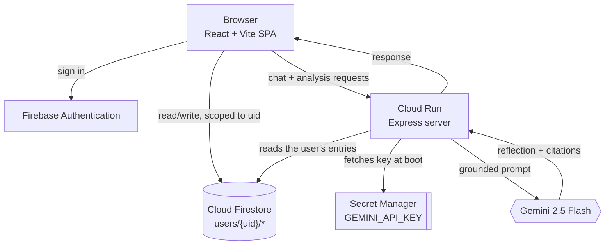

# EchoraOS

*"Your story, understood over time."*

Built for the Google Cloud Gen AI Academy APAC Ideathon (Cloud Run AI Challenge).

EchoraOS is a private journaling app. You write entries the way you'd write in any journal, and Gemini 2.5 Flash looks across them for the things a person re-reading their own diary might notice eventually — recurring themes, goals you've mentioned and maybe forgotten, how your mood has shifted over a few weeks. You can also just ask it things directly ("what's been draining my energy lately?") and it'll answer in a multi-turn conversation grounded in what you've actually written.

The part I cared about most: it shouldn't ever make something up about your life. Every observation the model makes links back to the specific entry it came from — click the citation, see the source. If it doesn't have enough journal data to answer something, it says so instead of guessing.

## How it fits together



The frontend talks to Firestore directly for reading and writing journal entries (security rules do the enforcement there, not application code), and talks to the Express backend only for anything that needs Gemini — chatting, single-entry analysis, longitudinal synthesis. The backend is the only thing that ever holds the Gemini API key.

## Privacy and data handling

A few principles shaped how data is handled here, loosely following GDPR-style expectations even though this is a hackathon project, not a shipped product:

| Principle | What it looks like here |
| :--- | :--- |
| Data access & portability | You can export your entries, conversations, and generated insights as a JSON file from Settings. |
| Right to erasure | "Delete All Data" removes everything from Firestore and clears local state. There's no soft-delete or backup copy kept around. |
| Privacy by design | Every document lives under `users/{uid}/...`, and Firestore rules deny access by default unless the request's auth UID matches the path. |
| Data minimization | No analytics pixels, no ad trackers. The only data collected is what the journaling and reflection features actually need. |
| User control | Export and delete both live in Settings, not buried in a support flow. |
| AI transparency | Generated reflections are visually distinct from your own writing, and are expected to cite the entries they're based on. |

The `users/{uid}` scoping above is enforced at the database layer via `firestore.rules` (below), not just filtered in the frontend — so even a compromised or buggy client can't read another user's data.

**Where the Gemini key lives:** locally it sits in `.env` and is read only by the Express server at request time — it's never bundled into the Vite frontend or committed to the repo. In production it's injected into the Cloud Run container from Secret Manager, via a service account that only has `secretmanager.secretAccessor` on that one secret. The React app never imports `@google/genai` and never sees the key.

## What it actually does

- **Multi-turn reflection with citations.** Ask about your own history and get answers grounded in specific entries. Responses embed `[[REF:entryId|title|date]]` tokens that render as clickable citations back to the source entry — this is how "grounded" is enforced rather than just claimed.
- **Longitudinal synthesis.** Pick a window (7/14/30 days, or all time) and it'll pull out recurring themes, milestones, stated goals, friction points, and a few reflection questions worth sitting with.
- **Guardrails against making things up.** The system prompt explicitly tells the model not to invent dates, people, or events, to separate observation from interpretation, to say when there isn't enough journal data to answer, and to stay away from anything that reads like a diagnosis.
- **Single-entry observations.** While writing, you can ask for a quick takeaway and a couple of follow-up questions on just that entry, without waiting for a longer synthesis run.

## Running it locally

**Prerequisites:** Node 20 or newer, and a Gemini API key (from Google AI Studio or Vertex AI) for local testing. In production this key comes from Secret Manager instead — see the deployment section below.

```bash
git clone https://github.com/SeyedRumaiz/Echora.git
cd Echora
npm install
cp .env.example .env
```

Open `.env` and set your key:

```env
GEMINI_API_KEY="your-actual-gemini-api-key"
```

Then start the dev server:

```bash
npm run dev
```

It boots at `http://localhost:3000` by default. The server reads `PORT` from the environment if it's set (Cloud Run sets this automatically at deploy time), so locally you can also run `PORT=4000 npm run dev` if 3000 is taken.

## Firestore rules

```rules
rules_version = '2';
service cloud.firestore {
  match /databases/{database}/documents {
    // Default deny all access
    match /{document=**} {
      allow read, write: if false;
    }

    // User-scoped isolation: every document must belong to the authenticated UID
    match /users/{userId} {
      allow read, write: if request.auth != null && request.auth.uid == userId;

      match /journalEntries/{entryId} {
        allow read, write: if request.auth != null && request.auth.uid == userId;
      }

      match /conversations/{conversationId} {
        allow read, write: if request.auth != null && request.auth.uid == userId;

        match /messages/{messageId} {
          allow read, write: if request.auth != null && request.auth.uid == userId;
        }
      }

      match /insights/{insightId} {
        allow read, write: if request.auth != null && request.auth.uid == userId;
      }

      match /settings/{settingId} {
        allow read, write: if request.auth != null && request.auth.uid == userId;
      }
    }
  }
}
```

If this is a fresh clone, the rules above live in the repo but aren't attached to any Firebase project yet. Link one first:

```bash
npm install -g firebase-tools
firebase login
firebase init firestore   # point it at your existing project, keep the existing firestore.rules
firebase deploy --only firestore:rules
```

(Or just paste the rules into Firebase Console → Firestore → Rules → Publish if you don't want to install the CLI.)

## Deploying to Cloud Run

```bash
export PROJECT_ID="your-google-cloud-project-id"
export REGION="asia-southeast1"   # or us-central1, wherever you're running
gcloud config set project $PROJECT_ID
```

Enable the APIs this needs:

```bash
gcloud services enable \
  run.googleapis.com \
  secretmanager.googleapis.com \
  artifactregistry.googleapis.com \
  cloudbuild.googleapis.com
```

Put the Gemini key in Secret Manager:

```bash
printf "%s" "YOUR_ACTUAL_GEMINI_API_KEY" | \
  gcloud secrets create GEMINI_API_KEY \
  --data-file=- \
  --replication-policy="automatic"
```

(If the secret already exists from a previous attempt, use `gcloud secrets versions add GEMINI_API_KEY --data-file=-` instead.)

Create a service account that can read that one secret and nothing else:

```bash
gcloud iam service-accounts create echoraos-runner \
  --display-name="EchoraOS Cloud Run Runner"

gcloud secrets add-iam-policy-binding GEMINI_API_KEY \
  --member="serviceAccount:echoraos-runner@${PROJECT_ID}.iam.gserviceaccount.com" \
  --role="roles/secretmanager.secretAccessor"
```

Then deploy:

```bash
gcloud run deploy echoraos \
  --source . \
  --region $REGION \
  --platform managed \
  --allow-unauthenticated \
  --port 3000 \
  --service-account "echoraos-runner@${PROJECT_ID}.iam.gserviceaccount.com" \
  --set-secrets="GEMINI_API_KEY=GEMINI_API_KEY:latest" \
  --labels="dev-tutorial=cloud-run-ai-challenge"
```

That label is required for the Ideathon's automated verification — easy to miss since it's not something `gcloud run deploy` asks for by default. If you already deployed once without it, you don't need to redeploy from scratch, just:

```bash
gcloud run services update echoraos --region $REGION --update-labels dev-tutorial=cloud-run-ai-challenge
```

Cloud Run builds the container from source and prints the HTTPS URL when it's done.

## Current state

Roughly what's working as of this writing:

- Firebase Authentication (Google sign-in, email/password, and a "Showcase Mode" demo login that doesn't need an account)
- Unauthenticated users are redirected away from private routes rather than the app just hiding a nav link
- Every Firestore document is scoped under `users/{uid}` and the rules above are what actually enforce that, not the frontend
- Multi-turn Gemini conversations persist across sessions and cite their sources
- The system prompt avoids anything resembling a medical or clinical claim
- `GEMINI_API_KEY` is only ever read server-side
- Full JSON export and a real delete-everything flow, per the privacy section above
- `/api/health` for Cloud Run's readiness and liveness checks

## License

Apache 2.0. Built for the Google Cloud Gen AI Academy APAC Ideathon.
